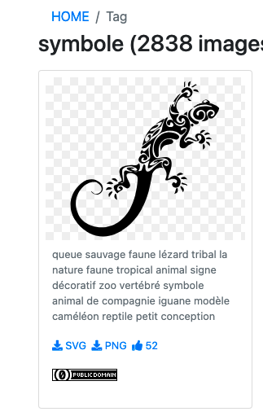
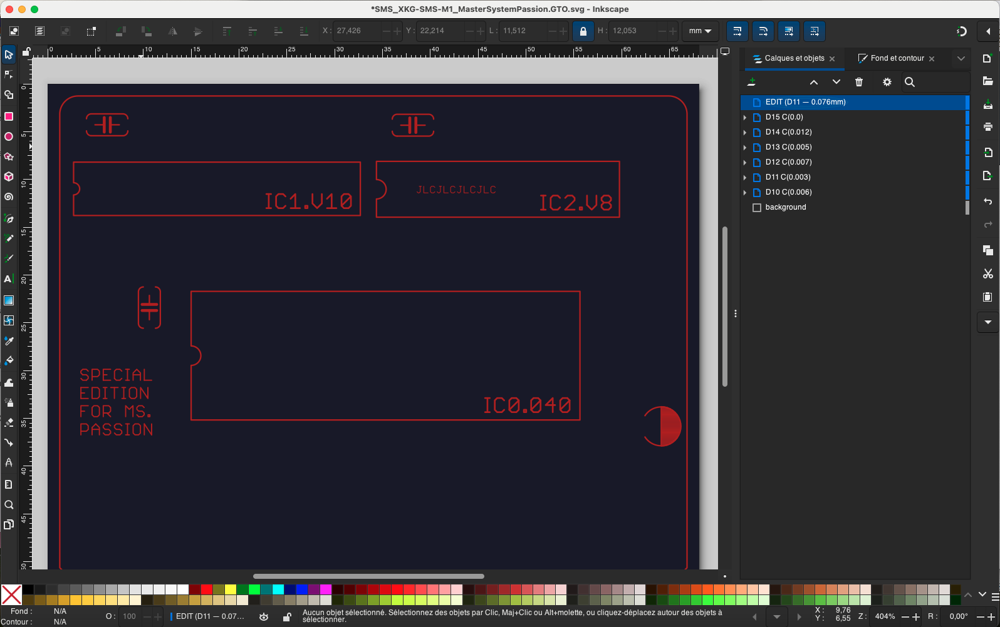
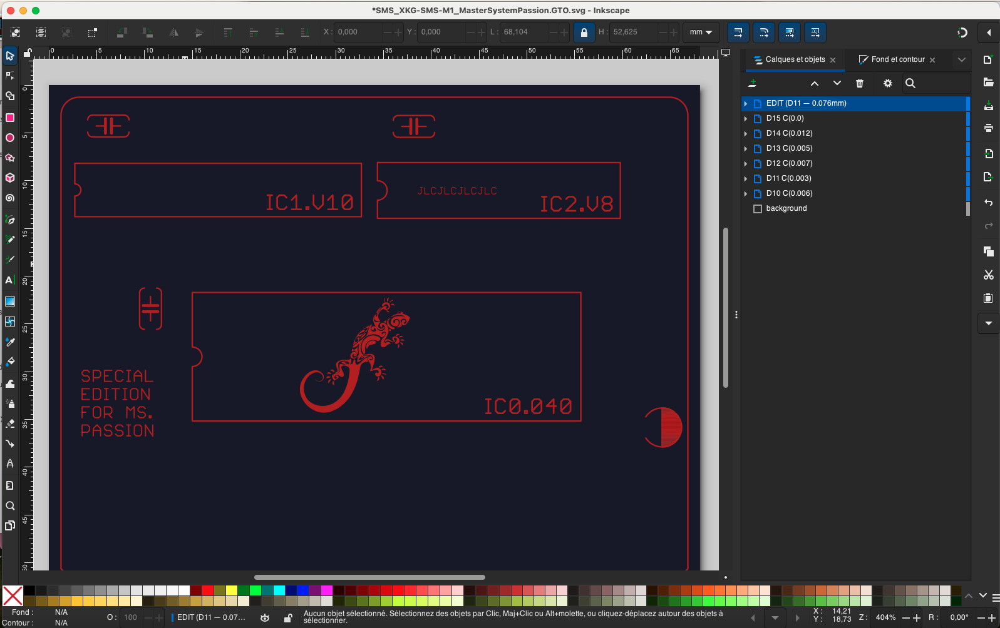
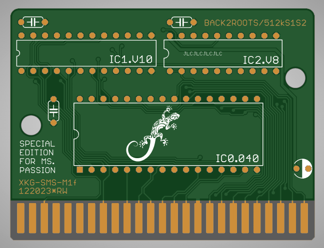

# gerber_tool.py

Outil de conversion **Gerber ↔ SVG** pour éditer des fichiers Gerber (sérigraphie, cuivre, masque…) dans Inkscape.

Zéro dépendance — Python pur.

---

## Utilisation

### Gerber → SVG (pour édition)

```bash
python3 gerber_tool.py --svg board.GTO [output.svg] [--outline board.GKO]
```

Génère :
- `board.GTO.svg` — fichier SVG éditable dans Inkscape
- `board.GTO.gerber_info.json` — métadonnées pour la reconversion

L'option `--outline` ajoute le contour du PCB en calque verrouillé (référence visuelle, ignoré à la reconversion).

### SVG → Gerber (après édition)

```bash
python3 gerber_tool.py --gerber board.GTO.svg [output.GTO]
```

Le fichier `.gerber_info.json` correspondant doit exister (créé à l'étape précédente).

Si l'output est omis : `board_EDIT.GTO`

### Auto-détection

```bash
python3 gerber_tool.py board.GTO              # → mode --svg
python3 gerber_tool.py board.GTO.svg          # → mode --gerber
```

---

## Workflow type

```
1.  python3 gerber_tool.py --svg board.GTO --outline board.GKO
2.  Ouvrir board.GTO.svg dans Inkscape
3.  Dessiner dans le calque "EDIT" (logos, texte, formes…)
4.  Sauvegarder
5.  python3 gerber_tool.py --gerber board.GTO.svg
6.  → board_EDIT.GTO prêt pour le fabricant
```

---

## Le calque EDIT

Le SVG généré contient un calque Inkscape **EDIT** en haut de la pile.
Tout ce qui est dessiné dedans sera converti en Gerber :

| SVG | Gerber |
|-----|--------|
| Forme avec `fill` | **Région** (G36/G37) — remplissage plein |
| Forme avec `fill` + trou (ex: lettre O) | **Région dark + clear** (G36/G37 + %LPC%) |
| Forme avec `stroke` | **Trace** (D01) — contour avec épaisseur d'aperture |

Les calques d'origine (apertures D10, D11…) sont préservés tels quels.
Le calque outline `[REF] Contour PCB` est verrouillé et ignoré à la reconversion.

---

## Extensions Gerber supportées

| Extension | Couche | Description |
|-----------|--------|-------------|
| `.GTL` | Top Copper | Cuivre face composants |
| `.GBL` | Bottom Copper | Cuivre face soudure |
| `.GTO` | Top Silkscreen | Sérigraphie face composants |
| `.GBO` | Bottom Silkscreen | Sérigraphie face soudure |
| `.GTS` | Top Soldermask | Vernis face composants |
| `.GBS` | Bottom Soldermask | Vernis face soudure |
| `.GTP` | Top Paste | Pâte à souder composants |
| `.GBP` | Bottom Paste | Pâte à souder soudure |
| `.GKO` | Board Outline | Contour du PCB |
| `.GML` | Milling Layer | Contour Eagle (= GKO) |

> **Note :** les fichiers `.DRL` (Excellon / perçages) utilisent un format différent et ne sont pas supportés.

---

## rename_gerbers.sh

Script utilitaire pour renommer les fichiers Gerber EagleCad vers des extensions standard reconnues par la plupart des outils.

```bash
./rename_gerbers.sh ./gerbers/
```

Renommages effectués :
- `.GML` → `.GKO` (Board Outline)
- `.TXT` → `.DRL` (Drill)

---

## Limites

- Pas de support des arcs Gerber (G02/G03)
- Pas de support des régions Gerber natives (G36/G37) à la lecture
- Pas de support du format Excellon (.DRL)
- Les courbes SVG (bézier, arcs) sont linéarisées en segments

## Quelques images
- Choix d'un dessin SVG


- Edition du fichier Gerber converti en SVG via Inkscape


- Importation du dessin dans le calque dédié


- Apercu du Gerber reconstitué apres convertion du SVG en gerber

